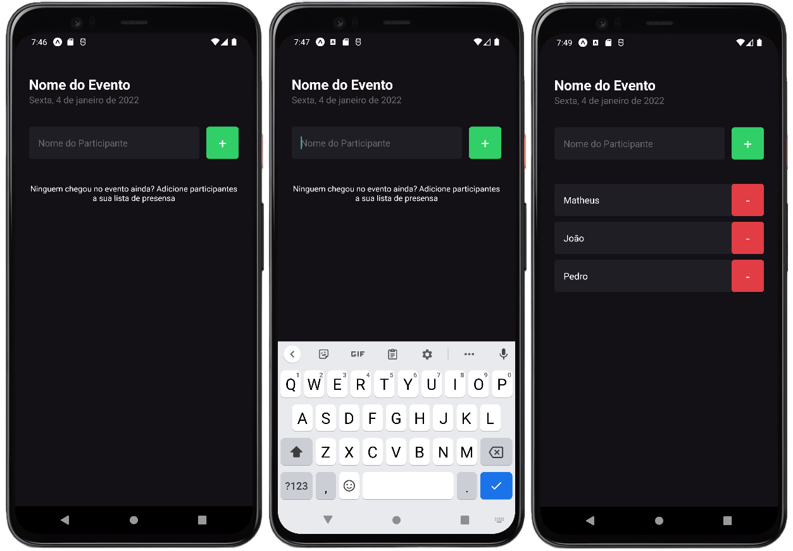

# 🚀 imhere

### App para promoção de eventos

Nesse desafio, foi desenvolvido uma aplicação de cadastro de eventos e inclusão de participantes

## 🖼️ Imagens finais do projeto

 

## 💻 Conceitos utilizados

Contendo os seguintes conteudos:

- Conceitos de hooks
- Utilizando `useState()` para manipular o estado da aplicação

- Entendendo imutabilidade

        Duas formas de alterar dados

        1 - Acessar o dado diretamente e mudar seu valor
        2 - Substituir todos os dados antigos por uma copia

        Então, ao invés de mudar uma propriedade espeficica, eu pego uma nova copia e substituto o valor antigo pelo novo

- Entendendo o render
  Etapas na rendenização de um componente
        1 - Acionar -> Ação foi solicitada
        2 - Rendenizar -> Ocorre o Rendering
        3 - Comprometer-se -> Entrega o conteudo rendenizado / Modifica a estrura na DOM

## ⚙️ Como utilizar este projeto?

Para executar o projeto é necessario ter o node instalado e o ambiente android configurado.
 
O projeto foi feito utilizando expo.
 
 
